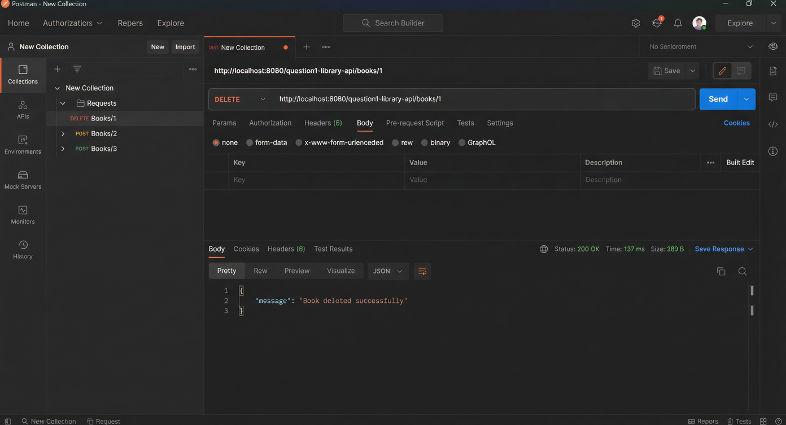
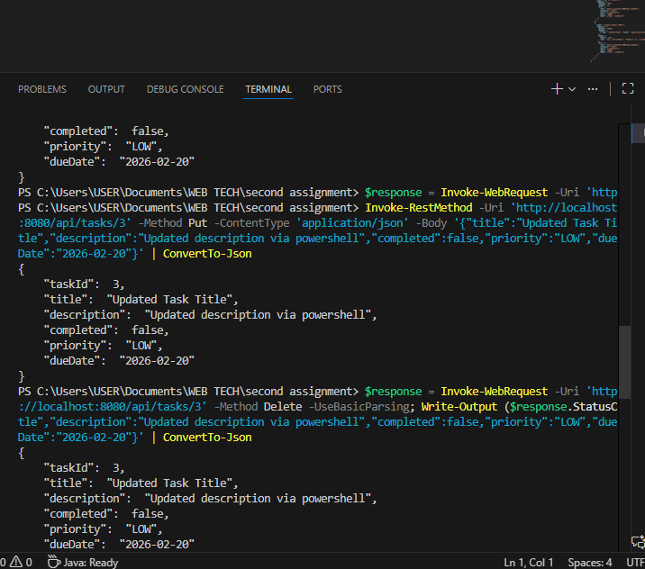

# Spring Boot REST API Project

REST API built with Spring Boot for my Web Tech class. Has 6 different APIs - books, students, menu items, products, tasks and user profiles.

## Setup

Need Java 17 and Maven installed.

```
mvn clean install
mvn spring-boot:run
```

Runs on http://localhost:8080

## What this project is (in plain words)
This is a single Spring Boot app that exposes six small, self‑contained APIs. There’s no database — each controller keeps an in‑memory list so you can test endpoints quickly without extra setup.

### Sketch map (big picture)
- Entry point: `RestApiApplication` boots the app.
- Models live in `model/*` and are simple POJOs.
- Controllers live in `controller/*` and own their own sample data lists.
- Base paths:
  - Books → `/api/books`
  - Students → `/api/students`
  - Menu → `/api/menu`
  - Products → `/api/products`
  - Tasks → `/api/tasks`
  - Users → `/api/users` (wrapped responses using `util/ApiResponse`)

### How requests flow
1. A request hits a controller method (e.g., `GET /api/books`).
2. The controller reads/writes its in‑memory list, often with Java Streams for filtering.
3. The method returns either the entity/list (200), a created entity (201), or no content on delete (204). If not found, it returns 404.

### Why this structure?
- Fast to run and grade; no DB or extra layers.
- Each domain is independent, so you can test or extend one without touching others.

## Project structure
```
second assignment/
├─ pom.xml
├─ README.md
├─ .gitignore
├─ images/
│  ├─ postman-collection.png
│  ├─ postman-delete-book.png
│  └─ terminal-powershell-tests.png
├─ src/
│  ├─ main/
│  │  ├─ java/com/restapi/
│  │  │  ├─ RestApiApplication.java
│  │  │  ├─ controller/
│  │  │  │  ├─ library/BookController.java
│  │  │  │  ├─ student/StudentController.java
│  │  │  │  ├─ restaurant/MenuController.java
│  │  │  │  ├─ ecommerce/ProductController.java
│  │  │  │  ├─ task/TaskController.java
│  │  │  │  └─ userprofile/UserProfileController.java
│  │  │  ├─ model/
│  │  │  │  ├─ library/Book.java
│  │  │  │  ├─ student/Student.java
│  │  │  │  ├─ restaurant/MenuItem.java
│  │  │  │  ├─ ecommerce/Product.java
│  │  │  │  ├─ task/Task.java
│  │  │  │  └─ userprofile/UserProfile.java
│  │  │  └─ util/ApiResponse.java
│  │  └─ resources/application.properties
│  └─ test/ (empty)
```

## APIs

### Books `/api/books`

GET /api/books - all books
GET /api/books/1 - single book
GET /api/books/search?title=code - search
POST /api/books - add book
DELETE /api/books/1 - delete

```
curl http://localhost:8080/api/books
```


### Students `/api/students`

GET /api/students
GET /api/students/1
GET /api/students/major/Computer%20Science
GET /api/students/filter?gpa=3.5
POST /api/students
PUT /api/students/1

### Menu `/api/menu`

GET /api/menu
GET /api/menu/1
GET /api/menu/category/Appetizer
GET /api/menu/available?available=true
GET /api/menu/search?name=salmon
POST /api/menu
PUT /api/menu/1/availability - toggles available
DELETE /api/menu/1

### Products `/api/products`

GET /api/products?page=1&limit=5
GET /api/products/1
GET /api/products/category/Electronics
GET /api/products/brand/Apple
GET /api/products/search?keyword=laptop
GET /api/products/price-range?min=100&max=500
GET /api/products/in-stock
POST /api/products
PUT /api/products/1
PATCH /api/products/1/stock?quantity=10
DELETE /api/products/1

Example:
```
curl "http://localhost:8080/api/products/price-range?min=50&max=200"
```

### Tasks `/api/tasks`

GET /api/tasks
GET /api/tasks/1
GET /api/tasks/status?completed=false
GET /api/tasks/priority/HIGH
POST /api/tasks
PUT /api/tasks/1
PATCH /api/tasks/1/complete
DELETE /api/tasks/1

### Users `/api/users`

Uses ApiResponse wrapper - returns {success, message, data}

GET /api/users
GET /api/users/1
GET /api/users/search/username?username=john_doe
GET /api/users/country/USA
GET /api/users/age-range?minAge=25&maxAge=35
POST /api/users
PUT /api/users/1
PATCH /api/users/1/activate
PATCH /api/users/1/deactivate
DELETE /api/users/1

Example response:
```json
{
  "success": true,
  "message": "Users retrieved successfully",
  "data": [...]
}
```

## Status Codes

200 - OK
201 - Created  
204 - Deleted
404 - Not found

## Screenshots (backup after the explanation)





